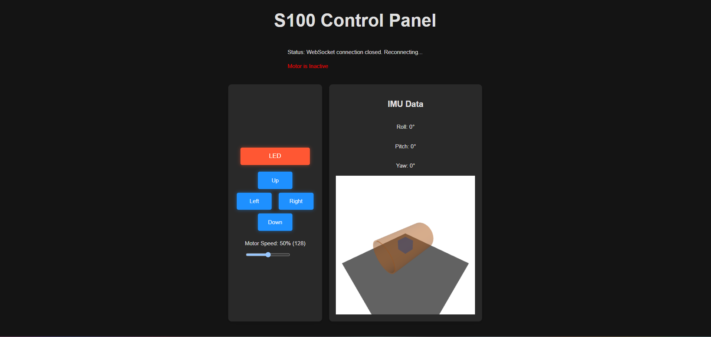

# Web UI for SX00 Robots 
The web UI is built in react and is currently being used to drive the motors via a microcontroller, set the motor speed and show IMU data with an IMU visualizer to show the robot moving in a pipe (currently a cube but a robot model can be added)

# Web UI for ESP32
esp_web_server_pio is for an esp32 S3 Dev and uses wifi to connect to the server. It is quite slow on some wifi networks. 

# Web UI for Teensy
webserver_teensy_eth is to run the same code as the esp32 but instead for a teensy via ethernet. This should allow for much greater throughput. Code is to be tested (TBT).

#React requirements
- npm v10.9.0
- vite v5.4.11

Make sure npm is installed globally. Once the repo is cloned cd into `S100_Interface/s100_webui/s100_webui/` and do `npm install`. This should install vite and all packages that the web UI uses.
